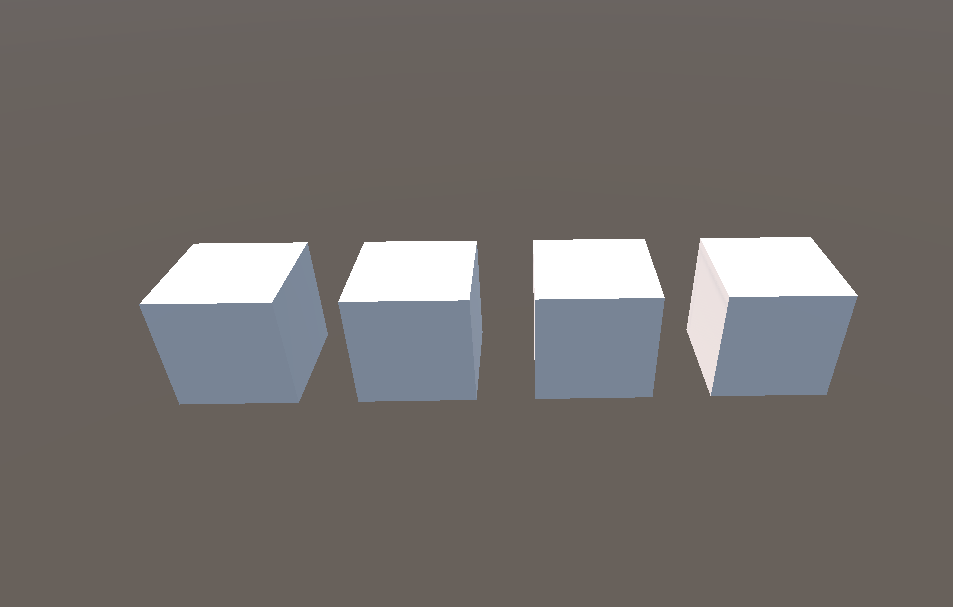

# Auto Arrange 3D

**Auto Arrange 3D** is a lightweight Unity tool that automatically arranges GameObjects in 3D space, similar to how Unity’s UI Layout Groups work but for world objects.

---

## ✨ Features

- 🔄 Automatic layout of child GameObjects in X, Y, or Z directions
- 📏 Custom spacing and padding
- 🎯 Align objects easily in a clean, predictable format
- 🧠 Editor-only execution (safe for runtime)
- ⚡ Live updates via `ExecuteAlways` or manual rebuild

---

## 📦 Installation

### Option 1: Unity Package Manager (via Git URL)

1. Open Unity.
2. Go to `Window > Package Manager`.
3. Click the `+` button and choose **Add package from Git URL...**
4. Paste this URL: https://github.com/promiseudomah/AutoArrange3D.git

---

## 🛠 Usage

1. Add the `AutoArrange3D` component to any GameObject.
2. Add child objects underneath it.
3. Choose your layout axis (X, Y, or Z).
4. Adjust spacing and padding as needed.
5. Toggle **Auto Update** or use the **Rebuild Layout** button.

---

## 📸 Example

---

## 🔖 License

MIT License. Free for personal and commercial use. Attribution appreciated but not required.

